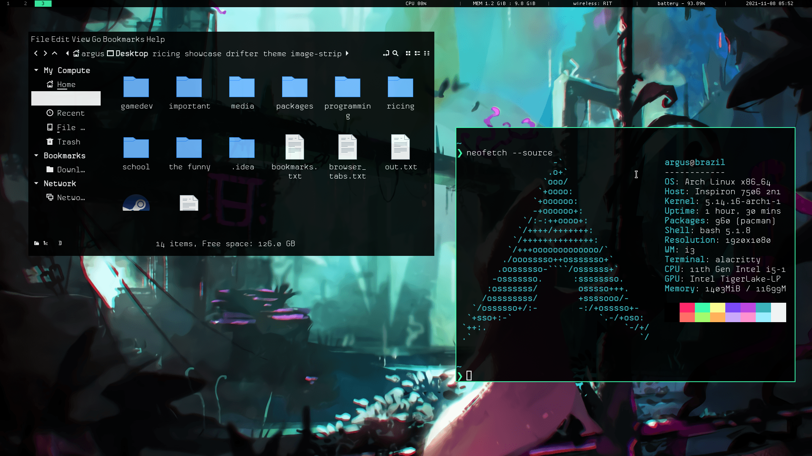

# drifter-dotfiles
dotfiles for my first rice, inspired by hyper light drifter and rain world. made for arch linux.



# DISCLAIMER

The GTK theme "Black-n-White" is made by user CRAZYT on gnome-look.org.  find the theme at https://www.gnome-look.org/p/1013445/. It's only included here for simplicity's sake. I am assuming the author doesn't get ad revenue or anything from that site, so I'm just including it in my dotfiles.

- my powercord theme is a modified version of the Comfy theme
- my rofi is modified dracula
- my vscode theme was originally nur's Just Black, heavily modified

# Installation
- clone this repo
- copy everything except .bashrc, .xinitrc, and .xbindkeysrc. look at those files and pick and choose things you'd like to add to your own keybind daemon and bashrc and xinitrc.
- go into .vscode-oss and take a look at info.txt, if you want my vscode theme. it wont work out of the box.
- install the boston icon theme.

# Programs used

```
WM:			i3-gaps
Compositor:		picom-git
Terminal:		alacritty
Browser:		qutebrowser
Launcher:		rofi
Visualizer:		cavalcade
Graphics tk:		gtk-3.0
Code editor:		code
Image viewer:		feh
Media player:		mpv
Calculator:		gnome-calculator
Discord client:	  powercord
```

the following are unconfigured by these dotfiles but recommended:
```
File managers:	nemo, ranger``

Document editor:	libreoffice  (in tools > options > accessibility,
enable "Automatically detect high contrast mode" and "use automatic
font color for screen display", and uncheck "use system colors for
page previews".
```

# Compositor Arguments

- remove ``exec picom`` from .xinitrc for an all-black, true dark mode.
- replace ``exec picom`` with ``picom --experimental-backends --backend glx`` in .xinitrc for dual kawase blur! makes windows no longer seamless, however.

# Gallery

<blockquote class="imgur-embed-pub" lang="en" data-id="a/2wWZDmC"><a href="//imgur.com/a/2wWZDmC">View post on imgur.com</a></blockquote><script async src="//s.imgur.com/min/embed.js" charset="utf-8"></script>
