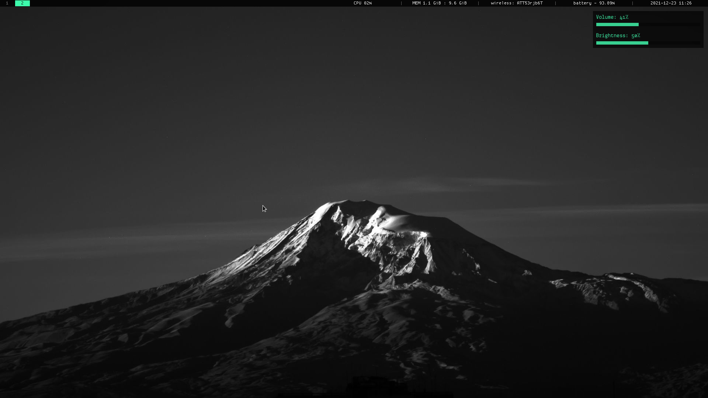

# drifter-dotfiles

dotfiles for my first rice, originally inspired by hyper light drifter and rain world. no longer really related to those games, but retains the teal-green color from HLD. made for arch linux.





# DISCLAIMER

The GTK theme "Black-n-White" is made by user CRAZYT on gnome-look.org.  find the theme at https://www.gnome-look.org/p/1013445/. It's only included here for simplicity's sake. I am assuming the author doesn't get ad revenue or anything from that site, so I'm just including it in my dotfiles.

- my rofi is modified dracula
- my vscode theme was originally nur's Just Black, heavily modified

# Installation
- clone this repo
- copy everything except .xinitrc into your home directory. i mean i guess you can copy xinit but i assume you just want to pick and choose my startup programs
- go into the vscode theme folder and take a look at info.txt if you want my vscode theme. it wont work out of the box.

# Programs used

```
WM:			i3-gaps 
Statusbar:		i3status
Compositor:		picom-git
Terminal:		alacritty
Music Player:		ncspot, mocp
Browser:		qutebrowser
File Manager:		ranger
Launcher:		rofi
Visualizer:		cava / cavalcade
Code editor:		vscode
Calculator:		gnome-calculator
Discord client:	        powercord
```

the following are unconfigured by these dotfiles but recommended:
```
Document editor:	libreoffice  (in tools > options > accessibility,
enable "Automatically detect high contrast mode" and "use automatic
font color for screen display", and uncheck "use system colors for
page previews".

PDF Viewer:		epdfview (enable invert colors)
```

# Compositor Arguments

- remove ``exec picom`` from .xinitrc for an all-black, true dark mode.

# Gallery

<blockquote class="imgur-embed-pub" lang="en" data-id="a/2wWZDmC"><a href="//imgur.com/a/2wWZDmC">View post on imgur.com</a></blockquote><script async src="//s.imgur.com/min/embed.js" charset="utf-8"></script>
